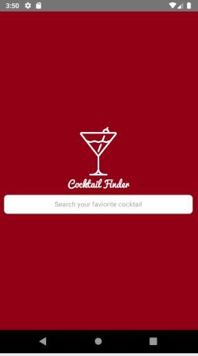
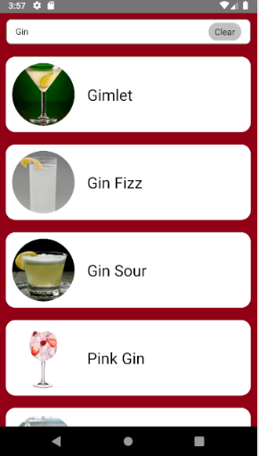

# Summary

This is the project given by foxbox which wanted a simple cocktail search which a user can click on the search then after typing their desired drink will return a response of blocks that are similar to the term they searched

	

# How to Install
We first want to download the repositiory

`git clone https://github.com/kevkevinpal/FoxBoxApplication.git`

Then we want to install all the node modules we need for this application so we do

`npm install`

then after we want to open up our android emulator and run the application by doing

`react-native run-android`

At this point the application should be running on the emulator

# How it Looks

# Files
 - App.js
	- In this file we set up our global variables since redux is not implemented yet.
	
	- But also we have our api call which changes the state to hold the data
		
	- It passes these props and functions into the wireframe component
		
	- this works kind of like a redux store as the global state for our components

	- This call either WireFrame1 or WireFrame2

 - WireFrame1.js
	- This is just the splash screen
		 
	
- WireFrame2.js 
	-  there are 3 functions/functional Compoents in this Component
			renderBlocks(): this renders the DrinkBlock Components
			renderClearButton(): this renders the clear button from a functional component
			renderLoadingOrBlocks(): this either renders the loading image or the blocks we wanted

 - DrinkBlock.js
		- This file only returns the View which is pretty simple just a block with an image and text field

